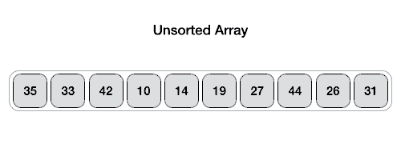

## Quick-Sort

### Visão Geral

O Quick Sort escolhe um **pivô**, particiona o array em dois grupos (menores e maiores que o pivô) e recursivamente ordena cada parte. É um dos algoritmos mais eficientes para ordenação.

---

### Complexidade Temporal

- Melhor caso: O(n log n)
- Caso médio: O(n log n)
- Pior caso (pivô sempre menor ou maior elemento): O(n²)

---

### Complexidade Espacial

- O(log n) (Recursivo, devido à pilha de chamadas)